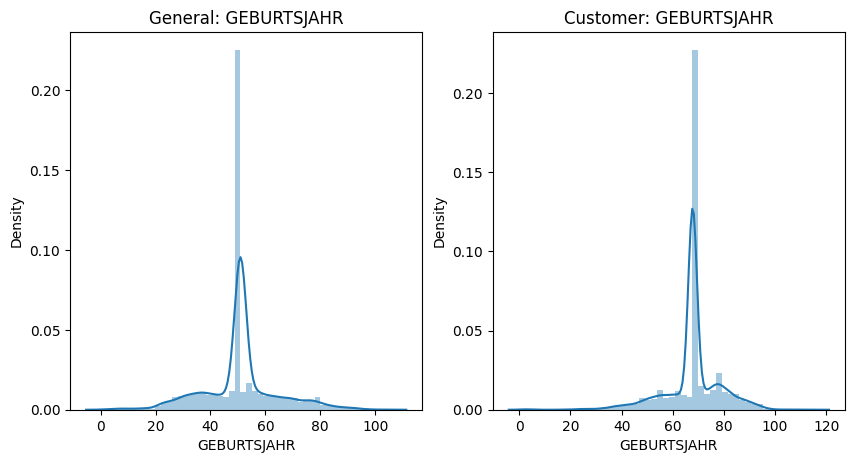
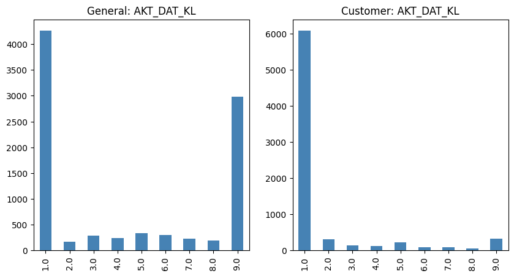
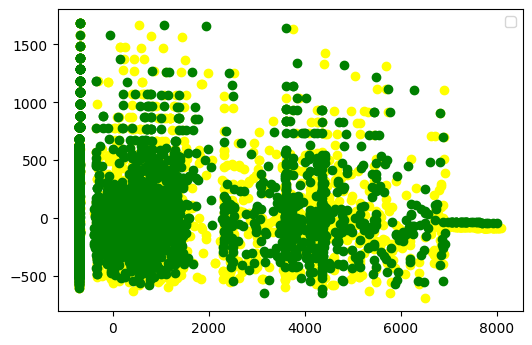
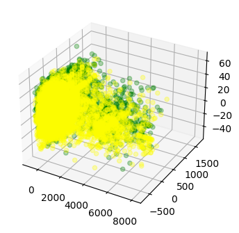
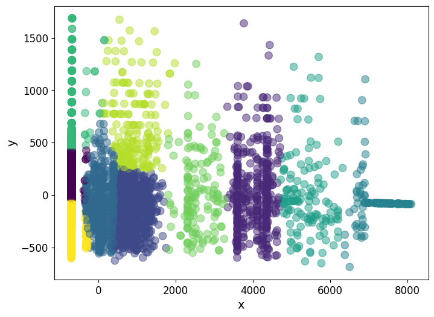

<div align="center">
  <h3 align="center">Create a Customer Segmentation Report for Arvato Financial Solutions</h3>


</div>

Underlying business questions are: How mail-order company acquire new clients more efficiently ? 
The project has two major steps: the customer segmentation report and the supervised learning model.


Table of contents:
  - Problem Introduction
  - Strategy to solve the problem
  - Metrics
  - EDA
  - Modelling
  - Hyperparameter tuning
  - Results
  - Conclusion/Reflection
  - Improvements

# Problem Introduction:
This is the final project of my choice. In this project, I will try to address 2 main questions.
- Question 1: With an existing customer data set, what data can be potential customers on a larger data set?
- Question 2: With a data set of people, how many people are likely to be your customers?

# Data Processing:
Before going into solving the questions, let's see and process the datasets.

## Gathering data:

There are four data files associated with this project:

- Udacity_AZDIAS_052018.csv: Demographics data for the general population of Germany; 891 211 persons (rows) x 366 features (columns).
- Udacity_CUSTOMERS_052018.csv: Demographics data for customers of a mail-order company; 191 652 persons (rows) x 369 features (columns).
- Udacity_MAILOUT_052018_TRAIN.csv: Demographics data for individuals who were targets of a marketing campaign; 42 982 persons (rows) x 367 (columns).
- Udacity_MAILOUT_052018_TEST.csv: Demographics data for individuals who were targets of a marketing campaign; 42 833 persons (rows) x 366 (columns).

Because of limitted memory usage, I will only load 10000 rows for `azdias` and `customers` datasets.


*Azdias data*

| Unnamed: 0 | LNR | AGER_TYP | AKT_DAT_KL | ALTER_HH | ALTER_KIND1 | ALTER_KIND2 | ALTER_KIND3 | ALTER_KIND4 | ALTERSKATEGORIE_FEIN |  ... | VHN | VK_DHT4A | VK_DISTANZ | VK_ZG11 | W_KEIT_KIND_HH | WOHNDAUER_2008 | WOHNLAGE | ZABEOTYP | ANREDE_KZ | ALTERSKATEGORIE_GROB |   |
|-----------:|----:|---------:|-----------:|---------:|------------:|------------:|------------:|------------:|---------------------:|-----:|----:|---------:|-----------:|--------:|---------------:|---------------:|---------:|---------:|----------:|---------------------:|---|
|      0     | 0   | 910215   | -1         | NaN      | NaN         | NaN         | NaN         | NaN         | NaN                  | NaN  | ... | NaN      | NaN        | NaN     | NaN            | NaN            | NaN      | NaN      | 3         | 1                    | 2 |
|      1     | 1   | 910220   | -1         | 9.0      | 0.0         | NaN         | NaN         | NaN         | NaN                  | 21.0 | ... | 4.0      | 8.0        | 11.0    | 10.0           | 3.0            | 9.0      | 4.0      | 5         | 2                    | 1 |
|      2     | 2   | 910225   | -1         | 9.0      | 17.0        | NaN         | NaN         | NaN         | NaN                  | 17.0 | ... | 2.0      | 9.0        | 9.0     | 6.0            | 3.0            | 9.0      | 2.0      | 5         | 2                    | 3 |
|      3     | 3   | 910226   | 2          | 1.0      | 13.0        | NaN         | NaN         | NaN         | NaN                  | 13.0 | ... | 0.0      | 7.0        | 10.0    | 11.0           | NaN            | 9.0      | 7.0      | 3         | 2                    | 4 |
|      4     | 4   | 910241   | -1         | 1.0      | 20.0        | NaN         | NaN         | NaN         | NaN                  | 14.0 | ... | 2.0      | 3.0        | 5.0     | 4.0            | 2.0            | 9.0      | 3.0      | 4         | 1                    | 3 |

*Customers data*

| Unnamed: 0 | LNR | AGER_TYP | AKT_DAT_KL | ALTER_HH | ALTER_KIND1 | ALTER_KIND2 | ALTER_KIND3 | ALTER_KIND4 | ALTERSKATEGORIE_FEIN |  ... | VK_ZG11 | W_KEIT_KIND_HH | WOHNDAUER_2008 | WOHNLAGE | ZABEOTYP | PRODUCT_GROUP |    CUSTOMER_GROUP | ONLINE_PURCHASE | ANREDE_KZ | ALTERSKATEGORIE_GROB |   |
|-----------:|----:|---------:|-----------:|---------:|------------:|------------:|------------:|------------:|---------------------:|-----:|--------:|---------------:|---------------:|---------:|---------:|--------------:|------------------:|----------------:|----------:|---------------------:|---|
|      0     | 0   | 9626     | 2          | 1.0      | 10.0        | NaN         | NaN         | NaN         | NaN                  | 10.0 | ...     | 2.0            | 6.0            | 9.0      | 7.0      | 3             | COSMETIC_AND_FOOD | MULTI_BUYER     | 0         | 1                    | 4 |
|      1     | 1   | 9628     | -1         | 9.0      | 11.0        | NaN         | NaN         | NaN         | NaN                  | NaN  | ...     | 3.0            | 0.0            | 9.0      | NaN      | 3             | FOOD              | SINGLE_BUYER    | 0         | 1                    | 4 |
|      2     | 2   | 143872   | -1         | 1.0      | 6.0         | NaN         | NaN         | NaN         | NaN                  | 0.0  | ...     | 11.0           | 6.0            | 9.0      | 2.0      | 3             | COSMETIC_AND_FOOD | MULTI_BUYER     | 0         | 2                    | 4 |
|      3     | 3   | 143873   | 1          | 1.0      | 8.0         | NaN         | NaN         | NaN         | NaN                  | 8.0  | ...     | 2.0            | NaN            | 9.0      | 7.0      | 1             | COSMETIC          | MULTI_BUYER     | 0         | 1                    | 4 |
|      4     | 4   | 143874   | -1         | 1.0      | 20.0        | NaN         | NaN         | NaN         | NaN                  | 14.0 | ...     | 4.0            | 2.0            | 9.0      | 3.0      | 1             | FOOD              | MULTI_BUYER     | 0         | 1                    | 3 |


The "CUSTOMERS" file contains three extra columns ('CUSTOMER_GROUP', 'ONLINE_PURCHASE', and 'PRODUCT_GROUP'), which provide broad information about the customers depicted in the file. 

As you can see in both of datasets almost columns/fields are categories.

## Clean data

In the data, we can process clean data by some steps:
- Remove unused columns/fields: `Unnamed: 0`, `LNR`
- Convert to numbers:
    - `EINGEFUEGT_AM`: Convert to numbers of days (today value I will set is 2018-01-01)
    - `EINGEZOGENAM_HH_JAHR`: Convert to numbers of years
    - `GEBURTSJAHR`: Convert to numbers of years
- Represent other categories by one-hot vectors
- Fill columns with NA values by mean values

## Visualize data
### Visualize one dimension `GEBURTSJAHR`



As you can see on the chart, there is an age difference between the two data sets:
- In general dataset: almost of people will be 50 years old
- But in targeted customers the age will be orders (~70 years old)
### Visualize one dimension for other columns for example `AKT_DAT_KL`


- In general dataset: almost people grouped in `AKT_DAT_KL` with value 1 or 9
- In targed customers people is grouped in `AKT_DAT_KL` with value 1 only

#### Visuallize for more than one dimention

Because we have more than 2000 features in each datasets, so to visualize them into 2D or 3D, I will 
decompose them into 2D or 3D by using PCA method. Then we can visualize them.

- PCA will be trained based on the `azidas` dataset
- PCA will transfored both of `azidas` and `customers` datasets, we get `Xt`, `Xt_cus` corresponding to `azidas` and `customers`
- Extract only 2D or 3D from these features

*Visualize 2D*


*Visualize 3D*


As the above charts we can see the are subset of general customer are customers, and there are
subset is not belonging to customers (the subset only below to yellow colors)


## Question 1: Customer Segmentation Report
In this section I will use unsupervised learning methods to analyze attributes of established customers and the general population in order to create customer segments.
From the existing customers we will analyze the attributes and matching them with bigger dataset (potential customers) to figure out which are people 
in Germany most likely new customers.

### Strategy to solve the problems
To find out which groups of potential customers are similar to the given set of customers, I will divide them into K groups (K = 10 for example) on the potential data set. From these K groups, I will map them on the given set of customers, to find out which groups have the largest number. From there, it will re-map the potential data set to find people who are likely to be their main customers.
To classify into K groups, I will use K-means (unsupervised learning) algorithm.

### Modelling

To find potential customers we can seperate the general dataset into K clusters. Then apply predict features
to categorize the customers into these K clusters. After that, we can compute which categories that 
customers belong to. From this point we can find which subset of general customers then consider for potential customers

- We can choose K = 10 clusters
```python
from sklearn.cluster import KMeans

model = KMeans(n_clusters=10)
Xt_kmeans = model.fit(Xt)
```


- Visualize the categories label on the general dataset:
After taking some time to train the model, we got the labeled records (0..K-1). We will visualize the data points according to the colors corresponding to the labels



We predict categories on the customer dataset:
```python


[[   0 2397]
 [   1  305]
 [   2  501]
 [   3 3071]
 [   4   64]
 [   5  116]
 [   6  699]
 [   7   88]
 [   8  182]
 [   9 2577]]

```


As you can see there are 3 most groups having biggest values: group with categories `0, 3, 9`

We can find potential customers by these value. I create new function name `get_potential_cus` support for query in `azidas` dataset.
```python
def get_potential_cus(_Xt, categories, _df):
    x_potential = model.predict(_Xt)
    indies = np.argwhere(np.isin(x_potential, categories)).ravel()
    return _df.iloc[indies]

get_potential_cus(Xt, [0, 3, 9], azdias)

get_potential_cus(Xt, [3], azdias)
```

### Results:

There are `7569` records. If we choose only highest group value (`3` in this case), the potential customers having `1879` records


## Question 2: Predict potential customers

I'll use the previous analysis to build a machine learning model that predicts whether or not each individual will respond to the campaign.


### Strategy to solve the problem
I will use the above pipeline convert the mail out dataset into clean data. Then I use the `RandomForestClassifier` model to predict 
the `RESPONSE` value is 0 or 1.

### Metrics:
I will use `precision`, `recall`, `f1-score` to evaluate the performance of models


### Modelling
I will use `RandomForestClassifier` model with default parameters then do the training on current dataset.
The dataset is seperated into training and test set data (testsize is 20%). 
```python
from sklearn.ensemble import RandomForestClassifier
from sklearn.metrics import classification_report

clf = RandomForestClassifier().fit(X_train, y_train)
y_pred = clf.predict(X_test)
report = classification_report(y_test,y_pred)

print(report)

```

### Results

- With out sampling data:
The result of this data and model is not very good, especially for the case where predict `RESPONSE` is ` 1.
```python

              precision    recall  f1-score   support

           0       0.99      1.00      0.99      8473
           1       0.00      0.00      0.00       120

    accuracy                           0.99      8593
   macro avg       0.49      0.50      0.50      8593
weighted avg       0.97      0.99      0.98      8593

```

The cause then i think is unbalanced data set problem: there are too many cases with label `RESPONSE` is 0.
We will find the way to sample on the data make more balance

### Improvements
I use `RandomOverSampler` from [imbalanced-learned](https://imbalanced-learn.org/stable/references/generated/imblearn.over_sampling.RandomOverSampler.html)

After training, I got the result:
```python
            precision    recall  f1-score   support

           0       0.92      0.98      0.95      8461
           1       0.98      0.92      0.95      8511

    accuracy                           0.95     16972
   macro avg       0.95      0.95      0.95     16972
weighted avg       0.95      0.95      0.95     16972

```

Now both precision and recall have more than 90%. 

We apply the trained model to predict on test data.
```python
mailout_test = pd.read_csv('./data/mailout_test.csv')
formated_mailout_test = convert_pipeline.op(mailout_test)

y_test_pred = clf.predict(formated_mailout_test)
print(f"There are: {len(y_test_pred[y_test_pred == 1])} customers (which response is 1) in {mailout_test.shape[0]} records")


```
There are: 893 customers (which response is 1) in 42833 records


# Conclusion
We can solve the questions using machine learning techniques:
- Grouping and comparing groups with customer data sets help us find out which groups are likely to be potential customers.
- The prediction of target customers by supervised learning technique.
Besides, the data imbalance also greatly affects the training results.